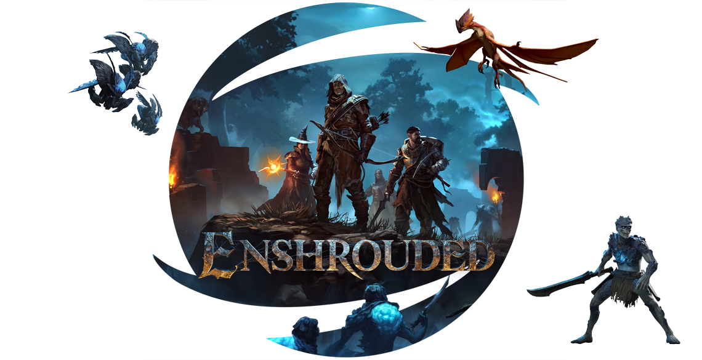

# Peon War Plan - Enshrouded

The PEON war plan that Peon uses to deploy your game server.

> **The official Enshrouded server is Windows only. As such, the plan has been built on top of a steamcmd+winehq container**



## Documentation

If you would like info on how to use this plan, the up-to-date documentation can be found in the [PEON project game guide](http://docs.warcamp.org/guides/games/enshrouded/).

[](https://ko-fi.com/K3K567ILJ)

## Stand-alone Use

This recipe can be used without the wider PEON project components.

### Guide

For this guide, please make sure you have [Docker Compose](https://docs.docker.com.zh.xy2401.com/v17.12/compose/install/) installed and running.

1. Download this folder and its contents.
2. Create a file `docker-compose.yml` in the directory with the contents as below.
3. Ensure that any scripts in the directory (i.e. `server_start`, `init_custom`) are executable by the docker user.
    ```bash
    chown 1000:1000 server_start
    chmod u+x server_start
    ```
4. Start the server. You can now start the server with the following command `docker-compose up -d`/`docker compose up -d`. You can then follow the deployment using `docker-compose logs -f`

#### docker-compose.yml

You can change any of the settings according to your needs.

```yml
version: '3'
services:
  server:
    container_name: peon.warcamp.enshrouded.${SERVERNAME}
    hostname: peon.steamcmd.enshrouded
    image: umlatt/steamcmd-winehq
    ports:
      - 15636:15636
      - 15637:15637
    environment:
      - STEAMID=2278520
      - PORT=15636
      - PORT=15637
      - SERVERNAME='the-enshrouded-server'
      - WORLDNAME='worldname'
      - PASSWORD='password'
    volumes:
      - ./actions:/actions
      - ./data:/home/steam/steamcmd/data
      - ./config:/home/steam/config
      - ./user:/home/steam/server_user_data
```